# 🤖 Instagram AI Agent

[](https://opensource.org/licenses/MIT)
[](https://www.python.org/downloads/)
[]()

> **⚡ Revolutionary AI-Powered Instagram Automation** - A fully autonomous Instagram agent that behaves exactly like a human, powered by advanced AI for natural interactions, content creation, and intelligent decision-making.

## 🌟 Features

### 🎯 **Autonomous Human-like Behavior**
- **Smart Feed Interaction**: Scrolls through feeds, analyzes content, and makes intelligent engagement decisions
- **Natural Conversations**: Responds to DMs with contextually appropriate messages
- **Story Engagement**: Views, reacts, and replies to stories like a real person
- **Reel Discovery**: Watches reels, analyzes content, and engages based on AI understanding

### 🧠 **AI-Powered Decision Making**
- **Sentiment Analysis**: Understands post emotions and context before engaging
- **Content Quality Assessment**: Evaluates posts and profiles for meaningful interactions
- **Relationship Intelligence**: Adapts behavior based on connection levels
- **Mood-Based Actions**: All activities influenced by dynamic AI mood states

### 🎨 **Advanced Content Creation**
- **AI Image Generation**: Creates stunning visuals based on current mood and context
- **Dynamic Captions**: Generates engaging captions with relevant hashtags
- **Story Creation**: Multiple formats - text, images, music, boomerangs
- **Custom Requests**: Generates personalized content when friends ask

### 📈 **Marketing & Growth**
- **Smart Following**: Analyzes profiles before following for quality connections
- **Engagement Optimization**: Strategic likes, comments, and shares for maximum reach
- **Brand Voice Consistency**: Maintains personality across all interactions
- **Growth Analytics**: Intelligent follower and engagement growth strategies

## 🏗️ System Architecture
### Overall Structure

```mermaid
graph TD
    Start([Instagram AI Agent Starts]) --> Login[Login to Instagram Account]
    Login --> MainLoop{Main Activity Loop}
    
    MainLoop --> ScrollFeed[Scroll Through Feed]
    MainLoop --> CheckMessages[Check Direct Messages]
    MainLoop --> ViewStories[View Stories]
    MainLoop --> ExploreReels[Explore Reels]
    MainLoop --> ProfileAnalysis[Analyze Profiles]
    MainLoop --> ContentGeneration[Generate Content]
    MainLoop --> StoryCreation[Create Stories]
    
    %% Feed Scrolling and Interaction
    ScrollFeed --> AnalyzePost{Analyze Post Content}
    AnalyzePost --> ReadCaption[Read Caption & Hashtags]
    AnalyzePost --> ViewComments[Read Existing Comments]
    AnalyzePost --> CheckPoster[Analyze Poster Profile]
    
    ReadCaption --> SentimentAnalysis{AI Sentiment Analysis}
    ViewComments --> CommentAnalysis{Analyze Comment Tone}
    CheckPoster --> RelationshipCheck{Check Relationship Level}
    
    SentimentAnalysis -->|Positive Content| LikeDecision{Decide to Like?}
    SentimentAnalysis -->|Negative Content| SkipPost[Skip Post]
    CommentAnalysis --> EngagementLevel{Calculate Engagement Level}
    RelationshipCheck -->|Close Friend| HighPriority[High Engagement Priority]
    RelationshipCheck -->|Stranger| LowPriority[Low Engagement Priority]
    
    LikeDecision -->|Yes| LikePost[👍 Like Post]
    LikeDecision -->|No| CommentDecision{Decide to Comment?}
    LikePost --> CommentDecision
    
    CommentDecision -->|Yes| GenerateComment[Generate Contextual Comment]
    CommentDecision -->|No| ShareDecision{Decide to Share?}
    GenerateComment --> PostComment[Post Comment]
    PostComment --> ShareDecision
    
    ShareDecision -->|Yes| ShareToStory[Share to Story]
    ShareDecision -->|No| NextPost[Move to Next Post]
    ShareToStory --> NextPost
    
    %% Reels Interaction
    ExploreReels --> WatchReel[Watch Reel]
    WatchReel --> AnalyzeReelContent{Analyze Reel Content}
    AnalyzeReelContent --> ReelDescription[Read Description]
    AnalyzeReelContent --> ReelComments[Read Comments]
    AnalyzeReelContent --> ReelMusic[Analyze Audio/Music]
    
    ReelDescription --> ReelSentiment{AI Content Analysis}
    ReelComments --> ReelEngagement{Analyze Engagement Quality}
    ReelMusic --> MoodAnalysis{Analyze Mood Compatibility}
    
    ReelSentiment -->|Matches Interests| ReelLike[👍 Like Reel]
    ReelSentiment -->|Doesn't Match| NextReel[Skip to Next Reel]
    ReelLike --> ReelCommentCheck{Generate Comment?}
    
    ReelCommentCheck -->|Yes| CreateReelComment[Create Relevant Comment]
    ReelCommentCheck -->|No| ReelShare{Share Reel?}
    CreateReelComment --> ReelShare
    
    ReelShare -->|Yes| ShareReelToStory[Share Reel to Story]
    ReelShare -->|Yes| SendReelToDM[Send Reel to Friends]
    ReelShare -->|No| NextReel
    
    %% Stories Interaction
    ViewStories --> StoryAnalysis{Analyze Story Content}
    StoryAnalysis --> StoryReaction{Generate Reaction?}
    StoryReaction -->|Yes| ReactToStory[Add Reaction Emoji]
    StoryReaction -->|No| ReplyToStory{Reply to Story?}
    ReactToStory --> ReplyToStory
    
    ReplyToStory -->|Yes| GenerateStoryReply[Generate Personal Reply]
    ReplyToStory -->|No| NextStory[View Next Story]
    GenerateStoryReply --> SendStoryReply[Send Story Reply]
    SendStoryReply --> NextStory
    
    %% Profile Analysis and Following
    ProfileAnalysis --> ViewProfile[Open Random Profile]
    ViewProfile --> ReadBio[Read Profile Bio]
    ViewProfile --> CheckPosts[View Recent Posts]
    ViewProfile --> CheckFollowers[Analyze Follower Count]
    ViewProfile --> MutualConnections[Check Mutual Friends]
    
    ReadBio --> BioCompatibility{Bio Matches Interests?}
    CheckPosts --> PostQuality{Assess Content Quality}
    CheckFollowers --> FollowerRatio{Good Follower Ratio?}
    MutualConnections --> TrustScore{Calculate Trust Score}
    
    BioCompatibility -->|Yes| PositiveSignal[+1 Follow Score]
    BioCompatibility -->|No| NegativeSignal[-1 Follow Score]
    PostQuality -->|High Quality| PositiveSignal
    PostQuality -->|Low Quality| NegativeSignal
    FollowerRatio -->|Good Ratio| PositiveSignal
    FollowerRatio -->|Suspicious Ratio| NegativeSignal
    TrustScore -->|High Trust| PositiveSignal
    TrustScore -->|Low Trust| NegativeSignal
    
    PositiveSignal --> FollowDecision{Total Score > Threshold?}
    NegativeSignal --> FollowDecision
    
    FollowDecision -->|Yes| FollowUser[➕ Follow User]
    FollowDecision -->|No| SkipUser[Skip User]
    FollowUser --> LikeRecentPosts[Like 2-3 Recent Posts]
    LikeRecentPosts --> NextProfile[Find Next Profile]
    SkipUser --> NextProfile
    
    %% Message Handling
    CheckMessages --> NewMessage{New Messages?}
    NewMessage -->|Yes| ReadMessage[Read Message Content]
    NewMessage -->|No| MessageEnd[Return to Main Loop]
    
    ReadMessage --> MessageAnalysis{Analyze Message Intent}
    MessageAnalysis --> FriendRequest{Friend Request?}
    MessageAnalysis --> Question{Question Asked?}
    MessageAnalysis --> Greeting{Greeting Message?}
    MessageAnalysis --> ReelShare{Shared Reel/Post?}
    
    FriendRequest --> ProfileCheck[Check Sender Profile]
    Question --> GenerateAnswer[Generate Helpful Answer]
    Greeting --> GenerateGreeting[Generate Friendly Response]
    ReelShare --> ViewSharedContent[View Shared Content]
    
    ProfileCheck --> AcceptDecision{Accept Request?}
    AcceptDecision -->|Yes| AcceptRequest[Accept Friend Request]
    AcceptDecision -->|No| DeclineRequest[Decline Request]
    
    GenerateAnswer --> SendReply[Send Reply Message]
    GenerateGreeting --> SendReply
    ViewSharedContent --> ReactToShared[React to Shared Content]
    ReactToShared --> SendReply
    
    SendReply --> MessageEnd
    AcceptRequest --> MessageEnd
    DeclineRequest --> MessageEnd
    
    %% Content Generation
    ContentGeneration --> ContentMood{Determine Current Mood}
    ContentMood --> ContentType{Choose Content Type}
    
    ContentType -->|Photo Post| GenerateImage[Generate AI Image]
    ContentType -->|Text Post| GenerateCaption[Generate Text Content]
    ContentType -->|Quote Post| GenerateQuote[Generate Inspirational Quote]
    
    GenerateImage --> ImageStyle{Choose Image Style}
    ImageStyle --> MoodBasedImage[Generate Mood-Based Image]
    MoodBasedImage --> AddCaption[Add Generated Caption]
    AddCaption --> AddHashtags[Add Relevant Hashtags]
    AddHashtags --> PostContent[📤 Post to Feed]
    
    GenerateCaption --> TextMood[Apply Current Mood to Text]
    GenerateQuote --> QuoteMood[Apply Current Mood to Quote]
    TextMood --> PostContent
    QuoteMood --> PostContent
    
    %% Story Creation
    StoryCreation --> StoryMood{Current Mood Check}
    StoryMood --> StoryType{Choose Story Type}
    
    StoryType -->|Image Story| GenerateStoryImage[Generate Story Image]
    StoryType -->|Text Story| GenerateStoryText[Generate Story Text]
    StoryType -->|Music Story| AddMusicStory[Add Music to Story]
    StoryType -->|Boomerang| CreateBoomerang[Create Boomerang Effect]
    
    GenerateStoryImage --> StoryFilters[Apply Random Filters]
    GenerateStoryText --> StoryBackground[Choose Background]
    AddMusicStory --> TrendingMusic[Select Trending Music]
    
    StoryFilters --> PostStory[📱 Post to Story]
    StoryBackground --> PostStory
    TrendingMusic --> PostStory
    CreateBoomerang --> PostStory
    
    %% Story Notes
    PostStory --> AddStoryNote{Add Story Note?}
    AddStoryNote -->|Yes| GenerateNote[Generate Mood-Based Note]
    AddStoryNote -->|No| StoryEnd[Story Complete]
    GenerateNote --> PostNote[Post Story Note]
    PostNote --> StoryEnd
    
    %% Friend Interaction and Mood-Based Generation
    SendReply --> FriendRequest2{Friend Asks for Image?}
    FriendRequest2 -->|Yes| FriendMoodCheck[Check AI Agent's Mood]
    FriendRequest2 -->|No| MessageEnd
    
    FriendMoodCheck --> MoodImageGen[Generate Mood-Based Image]
    MoodImageGen --> SendImageToFriend[Send Generated Image]
    SendImageToFriend --> MessageEnd
    
    %% Self Introduction
    GenerateGreeting --> IntroCheck{First Time Meeting?}
    IntroCheck -->|Yes| SelfIntroduction[Generate Human-like Introduction]
    IntroCheck -->|No| CasualGreeting[Generate Casual Greeting]
    
    SelfIntroduction --> PersonalDetails[Add Personal Details & Interests]
    PersonalDetails --> FriendlyTone[Use Friendly, Human Tone]
    FriendlyTone --> SendIntro[Send Introduction Message]
    CasualGreeting --> SendReply
    SendIntro --> MessageEnd
    
    %% Return to Main Loop
    NextPost --> MainLoop
    NextReel --> MainLoop
    NextStory --> MainLoop
    NextProfile --> MainLoop
    MessageEnd --> MainLoop
    PostContent --> MainLoop
    StoryEnd --> MainLoop
    SkipPost --> MainLoop
    
    %% Styling
    classDef decisionNode fill:#FFE4B5,stroke:#D2691E,stroke-width:2px
    classDef actionNode fill:#98FB98,stroke:#228B22,stroke-width:2px
    classDef analysisNode fill:#E6E6FA,stroke:#4B0082,stroke-width:2px
    classDef contentNode fill:#FFB6C1,stroke:#DC143C,stroke-width:2px
    classDef startEnd fill:#87CEEB,stroke:#4682B4,stroke-width:3px
    
    class Start,MainLoop startEnd
    class AnalyzePost,SentimentAnalysis,CommentAnalysis,RelationshipCheck,LikeDecision,CommentDecision,ShareDecision decisionNode
    class AnalyzeReelContent,ReelSentiment,ReelEngagement,ReelCommentCheck,ReelShare decisionNode
    class StoryAnalysis,StoryReaction,ReplyToStory decisionNode
    class BioCompatibility,PostQuality,FollowerRatio,TrustScore,FollowDecision decisionNode
    class MessageAnalysis,FriendRequest,Question,Greeting,AcceptDecision decisionNode
    class ContentMood,ContentType,ImageStyle,StoryMood,StoryType,AddStoryNote decisionNode
    class LikePost,PostComment,ShareToStory,ReactToStory,SendReply actionNode
    class FollowUser,AcceptRequest,PostContent,PostStory actionNode
    class ReadCaption,ViewComments,CheckPoster,GenerateComment,ReadBio analysisNode
    class GenerateImage,GenerateCaption,GenerateStoryImage,MoodImageGen contentNode
```


### Main Agent Flow


### Content Generation System


### Message Processing Flow


### Profile Analysis & Following Decision


## 🖥️ System Requirements

### **Minimum Requirements**
- **GPU**: NVIDIA RTX 3050 or better (6GB VRAM minimum)
- **RAM**: 16GB DDR4 or higher
- **CPU**: Intel i5-8400 / AMD Ryzen 5 2600 or better
- **Storage**: 50GB free space (SSD recommended)
- **OS**: Windows 10/11, macOS 10.15+, or Ubuntu 18.04+

### **Recommended Specifications**
- **GPU**: NVIDIA RTX 4070 or better (12GB+ VRAM)
- **RAM**: 32GB DDR4/DDR5
- **CPU**: Intel i7-10700K / AMD Ryzen 7 3700X or better
- **Storage**: 100GB free space (NVMe SSD)
- **Internet**: Stable broadband connection (10+ Mbps)

### **Software Dependencies**
- Python 3.8+
- CUDA 11.8+
- PyTorch 2.0+
- Additional packages listed in `requirements.txt`

## 🚀 Quick Start

### Installation
```bash
# Clone the repository
git clone https://github.com/your-username/instagram-ai-agent.git
cd instagram-ai-agent

# Install dependencies
pip install -r requirements.txt

# Set up configuration
cp config.example.json config.json
```

### Configuration
```json
{
  "instagram": {
    "username": "your_instagram_username",
    "password": "your_instagram_password"
  },
  "ai_settings": {
    "personality": "friendly",
    "activity_level": "medium",
    "content_style": "casual"
  }
}
```

### Run the Agent
```bash
python main.py
```

## 📊 Marketing Capabilities

### **Growth Strategy**
- **Organic Follower Growth**: Smart following and engagement strategies
- **Content Optimization**: AI-driven content creation for maximum engagement
- **Audience Analysis**: Deep insights into follower behavior and preferences
- **Competitor Monitoring**: Track and learn from competitor strategies

### **Engagement Optimization**
- **Peak Time Posting**: Automatically posts when your audience is most active
- **Hashtag Intelligence**: Uses trending and relevant hashtags for maximum reach
- **Story Engagement**: Maintains active story presence for algorithm boost
- **Cross-Platform Sync**: Coordinates with other social media activities

### **Brand Management**
- **Consistent Voice**: Maintains brand personality across all interactions
- **Crisis Management**: Intelligent response to negative feedback
- **Influencer Outreach**: Identifies and engages with potential brand advocates
- **Performance Analytics**: Detailed reports on growth and engagement metrics

## 🔒 Privacy & Security

- **Local Processing**: All AI computations run locally on your machine
- **No API Dependencies**: Direct Instagram interaction without third-party APIs
- **Encrypted Storage**: Secure credential and data storage
- **Privacy Compliant**: Respects Instagram's terms of service and user privacy

## 🛠️ Technical Features

### **AI Technologies**
- **Natural Language Processing**: Advanced text understanding and generation
- **Computer Vision**: Image analysis and generation capabilities
- **Machine Learning**: Continuous learning from interactions and feedback
- **Neural Networks**: Deep learning models for human-like behavior

### **Automation Features**
- **24/7 Operation**: Runs continuously with smart scheduling
- **Rate Limiting**: Intelligent activity pacing to avoid detection
- **Error Recovery**: Automatic error handling and recovery mechanisms
- **Logging**: Comprehensive activity logs and analytics

## 🎯 Use Cases

### **Personal Branding**
- Maintain active social media presence
- Build authentic follower relationships
- Create consistent content stream
- Engage with community naturally

### **Business Marketing**
- Automated customer engagement
- Lead generation and nurturing
- Brand awareness campaigns
- Competitive intelligence gathering

### **Content Creators**
- Automated audience engagement
- Content inspiration and creation
- Community management
- Growth acceleration

### **Agencies & Marketers**
- Multi-account management
- Campaign automation
- Client reporting
- Scalable social media services

## 📈 Performance Metrics

### **Engagement Rates**
- **Like Rate**: 15-25% increase in organic likes
- **Comment Quality**: 90%+ relevant and contextual comments
- **Story Views**: 30-40% boost in story engagement
- **Message Response**: <2 minute average response time

### **Growth Statistics**
- **Follower Growth**: 10-20% monthly organic growth
- **Engagement Rate**: 5-8% average engagement rate
- **Content Performance**: 40% increase in post reach
- **Time Savings**: 95% reduction in manual social media management

## 🤝 Contributing

We welcome contributions! Please read our [Contributing Guidelines](CONTRIBUTING.md) before submitting pull requests.

### **Development Setup**
```bash
# Install development dependencies
pip install -r requirements-dev.txt

# Run tests
pytest tests/

# Code formatting
black src/
flake8 src/
```

## 📞 Support & Contact

### **Get Help**
- 📧 **Email**: soloaidev@gmail.com
- 📖 **Documentation**: [Full Documentation](docs/)
- 🐛 **Issues**: [GitHub Issues](issues/)
- 💬 **Community**: [Discord Server](discord/)

### **Enterprise Support**
For enterprise deployments, custom integrations, or dedicated support, contact us at soloaidev@gmail.com

## 📝 License

This project is licensed under the MIT License - see the [LICENSE](LICENSE) file for details.

## ⚠️ Disclaimer

This tool is for educational and research purposes. Users are responsible for complying with Instagram's Terms of Service and applicable laws. Use responsibly and respect others' privacy.

## 🔮 Coming Soon

- **Multi-Platform Support**: Facebook, Twitter, TikTok integration
- **Advanced Analytics**: Machine learning-powered insights
- **Team Collaboration**: Multi-user management features
- **API Integration**: Third-party service connections
- **Mobile App**: iOS/Android companion apps

---

### 🌟 **Stay Tuned - Release Coming Soon!**

⭐ **Star this repository** to get notified when we launch!

📢 **Follow us** for updates and announcements

🚀 **Join our community** to be among the first to experience the future of Instagram automation

---

*Made with ❤️ by the Solo AI Dev Team*
